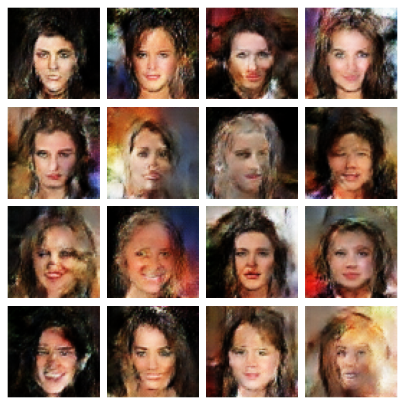

# DCGAN Face Generator

A TensorFlow/Keras DCGAN trained on the CelebA dataset to generate new `64 × 64` RGB face images from random 100-dimensional latent vectors.

## Instructions

Open `face_generator.ipynb` and run the cells in order. The notebook contains:

- **Data pipeline:** loads CelebA, crops and resizes the images, normalizes them to `[-1, 1]`, and creates batches.
- **Model implementation:** builds a convolutional generator and discriminator.
- **Training:** uses binary cross-entropy, Adam optimizers, label smoothing, and custom `GradientTape` updates.
- **Evaluation:** calculates Inception Score, FID, and discriminator accuracy.

## Generated faces after epoch 20

